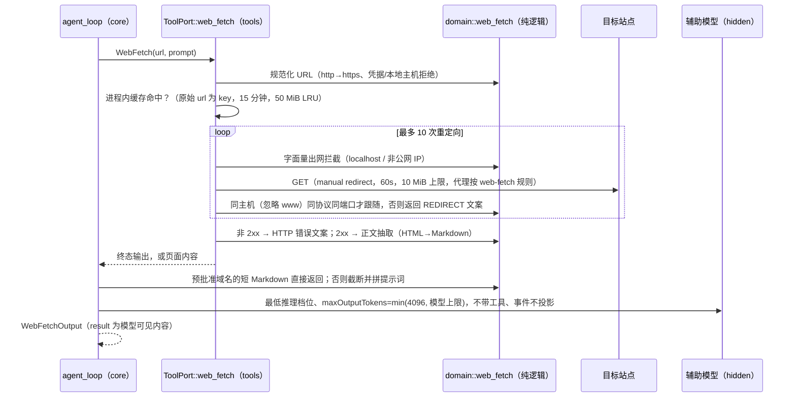

# Rust WebFetch（对齐 TS `core/src/tool/handlers/webfetch*.ts`）

2026-09-25。Node 默认向模型暴露 WebFetch，Rust 没有该工具（rust-tool-surface.md 阶段 2）。

## 所有者与流程

- 纯逻辑（URL、出网判定、重定向、正文抽取、截断、提示词）在 `domain::web_fetch`，由 TS 生成的语料逐条比对。
- 网络与缓存在 `tools::web_fetch`；缓存为进程级，与 TS 模块级缓存语义相同。
- 辅助模型：`ModelPort::auxiliary()` 取当前模型的最低推理档（TS `auxiliaryModelOptions`：`optionSpecs.reasoningLevel.values[0]`）；
  无注册表的显式模型配置沿用当前档位。调用复用 `hidden_summary`：只转发重试与鉴权事件。
- 权限沿用已有能力表（`webfetch`，按 `domain:<host>` 匹配规则，预批准域名免确认）；并发安全与 TS 一致。

## 已知差异

- 大正文不写 artifact（TS 在有 artifactStore 时写入并返回 `artifactUri/artifactPath`，两字段为可选）。
- 不发 `networkRequestStatus` 进度事件。
- `statusText` 取 HTTP 规范原因短语（Node 为响应行原文，HTTP/2 下为空时回落 `STATUS_CODES`）。
- 截断在 UTF-16 边界切开代理对时，TS 留下孤立代理项，Rust 以 U+FFFD 代替（语料按 `toWellFormed()` 比对）。
- HTML 实体解码遇到代理项码点（`&#xD800;` 等）时同样以 U+FFFD 代替。
- 错误以现有 `Tool failed: <message>` 形式返回模型，文案与 TS 相同。

## 验收

- `scripts/generate-zcode-cli-rust-webfetch-corpus.mjs`：URL 59 条、重定向 45 条、正文抽取 23 条、截断 6 条、处理 16 条，Rust 逐条比对。
- tools 单测以注入的传输层覆盖：重定向跟随/跨主机终止/超过上限、HTTP 错误与 Retry-After、代理拦截头、超大响应、缓存命中。
- 请求差分用例把 WebFetch 从待实现名单移出：描述与参数与 Node 一致。
