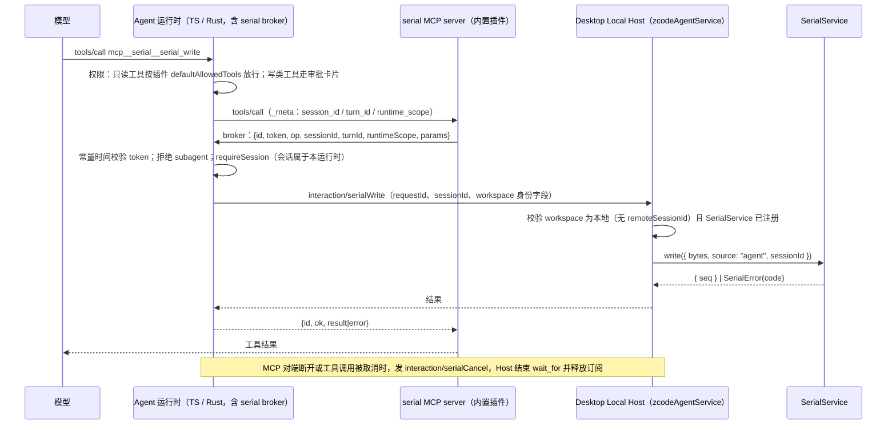

# 串口调试器第二期：Agent 串口工具

2026-10-10。用户决定：Agent 与人共用第一期的串口会话（`docs/specs/serial-port-debugger.md`）。
Agent 通过内置官方插件中的 serial MCP server 访问串口；TS CLI 与 Rust runtime 同期实现，行为一致。

## 范围

- 仅本窗口本地 workspace 的主会话可用。远程 workspace（Agent 运行在远端机器）、Web 端、子 agent 不可用。
- 内置官方插件 `serial`，Desktop 上默认启用，可在插件管理中关闭；关闭后 Agent 不再看到该组工具。
- 不新增 UI 组件：审批复用现有审批卡片；面板只扩展 TX 行的来源标注。

## 工具

| 工具              | 审批     | 说明                                                       |
| ----------------- | -------- | ---------------------------------------------------------- |
| `serial_list`     | 默认放行 | 串口列表与当前状态（state、path、config、error）           |
| `serial_read`     | 默认放行 | 按 `seq` 游标增量读取收发记录                              |
| `serial_wait_for` | 默认放行 | 等待 RX 中出现匹配正则的输出                               |
| `serial_open`     | 需审批   | 关闭状态下按参数打开；已打开时只复用完全一致的 path+config |
| `serial_write`    | 需审批   | 写入文本或 HEX                                             |
| `serial_close`    | 需审批   | 关闭串口                                                   |

### 参数与结果

- `serial_open`：`{ path, baudRate, dataBits?=8, parity?="none", stopBits?=1, rtscts?=false }`。
  `autoReconnect` 继承用户在该串口记住的偏好，缺省为 `true`。
  串口已打开且 path 与参数完全一致时直接成功（`reused: true`）；不一致时返回 `busy`，
  错误消息说明当前 path 与参数。Agent 不能借此切换用户正在使用的串口。
- `serial_write`：`{ data, encoding?="utf-8" | "hex", lineEnding?="none" | "cr" | "lf" | "crlf" }`。
  `hex` 时 `data` 按第一期 HEX 规则解析且不追加行尾。单次上限沿用 64 KiB。返回 `{ bytes, seq }`。
- `serial_read`：`{ sinceSeq?, direction?="rx" | "tx" | "both", encoding?="utf-8" | "gbk" | "hex", maxBytes?=8192 }`。
  - `sinceSeq` 缺省表示从调用时刻开始，也就是只读之后的新数据；此时立即返回空结果和当前 `lastSeq`，
    供下一次调用接着读。传 `0` 表示读取缓冲区中全部历史。
  - `maxBytes` 上限 32768，按原始字节计。
  - 返回 `{ text, lastSeq, truncated, evicted, status }`。`evicted` 表示 `sinceSeq` 之后的部分数据
    已被环形缓冲淘汰。`truncated` 时 `lastSeq` 指向已返回的最后一个 chunk，下次从这里继续。
  - 文本形式与第一期导出一致：每个 chunk 一行，带方向（`RX`/`TX`）；`direction="rx"` 时只输出内容，不加前缀。
- `serial_wait_for`：`{ pattern, flags?, sinceSeq?, timeoutMs?=10000, encoding?="utf-8" | "gbk" }`。
  - `timeoutMs` 上限 120000。`pattern` 是 JavaScript 正则源码，按 `flags` 编译，非法时返回 `invalidInput`。
  - 匹配范围是 `sinceSeq`（缺省为调用时刻）之后解码的 RX 文本。用户清屏不影响等待。
  - 结果：
    - 匹配成功：`{ matched: true, match, context, seq }`，`context` 为匹配前最多 512 字节。
    - 未匹配：`{ matched: false, reason, tail, lastSeq }`，`tail` 为最近 2 KiB 的 RX；
      `reason` 为 `timeout`（超时）、`disconnected`（串口断开或关闭）或 `cancelled`（调用被取消，
      仅用于 Host 给原请求的收尾应答，运行时已不再等待）。
  - Rust 侧正则方言与 JS 存在差异；pattern 编译与匹配统一在 Host（Node）执行，运行时只转发，不做匹配。
- `serial_close`：`{}`。

错误统一为工具失败，消息带第一期的 `SerialErrorCode`，另新增 `unavailable`：当前会话不可用，
原因为远程 workspace、子 agent 或 Host 未提供串口。Host 以 JSON-RPC 错误码 `-32010` 应答串口业务失败，
`error.data.code` 携带上述错误码；TS 与 Rust broker 原样转成工具失败（Rust 的 `HostReply` 因此保留 `error.data`）。

## 所有者与事件顺序

- 串口状态的唯一所有者仍是窗口级 Desktop Local Host 的 `SerialService`。broker、MCP server
  和运行时都只转发，不缓存串口数据。
- `serial_read` 与 `serial_wait_for` 都在 Host 内基于 `SerialService` 的快照与 `onData` 计算。
  游标语义与 renderer 的去重规则相同：先订阅再取快照，按 `seq` 合并。

- broker 由 Agent 进程持有，一个 Agent 进程一个（一个 workspaceKey 对应一个 Agent 进程），
  命名、token 和请求格式照搬 node_repl browser broker：
  - Windows 为 `\\.\pipe\zcode-serial-<uuid>`，其他平台为 `<tmpdir>/zsr-<uuid>.sock`；
  - token 为 32 字节随机数，只通过 env（`ZCODE_SERIAL_BROKER_SOCKET` / `ZCODE_SERIAL_BROKER_TOKEN`）
    注入 serial MCP server；
  - 每个请求一行 JSON，上限 1 MiB。
- 会话身份以运行时从 MCP `_meta` 中取得并通过 `requireSession` 确认的 `sessionId` 为准；
  MCP server 不能自报会话。
- Host 在 `zcodeAgentService.onRequest` 中处理 `interaction/serial*`，直接调用同进程的 `ISerialService`。
  `packages/server`（远程或独立 server）没有串口服务，返回 `unavailable`。

## 启用门控

- Host 只在 `shouldRegisterSerialService(serviceAuthorityMode)` 为真时，向 Agent spawn env
  注入 `ZCODE_HOST_SERIAL=1`。
- 运行时（TS 与 Rust）仅在看到该标记、且 `serial` 官方插件处于启用状态时，注册 serial MCP server
  并创建 broker。
- broker 的 socket 与 token 只写入 serial server 配置的 env，从不进入 Agent 进程的全局环境，
  因此不会泄露给 Bash 或其他 MCP。两者都**不能**加入 CLI 的 sanitize 列表：CLI 入口会在启动时就地清理
  该列表，serial server 本身也由 CLI（`__zcode-plugin-host`）启动，加入后会读不到连接材料；
  `ZCODE_HOST_SERIAL` 同理会在运行时入口读取之前被清掉。`ZCODE_HOST_SERIAL=1` 只是非机密的能力标记。

## 取消

反向请求没有通用取消机制，新增方法 `interaction/serialCancel { sessionId, targetRequestId }`：
工具调用被取消或 MCP 对端断开时由 broker 发送，Host 只终止同一会话发起的、仍在进行的 `waitFor`；
目标不存在或已结束时为空操作（幂等），立即应答 `{}`。

## 审批

- 官方插件定义新增 `defaultAllowedTools` 字段，`serial` 插件声明 `serial_list`、`serial_read`、`serial_wait_for`。
  该字段只对本插件 MCP server 的同名工具生效，不改变其他 MCP 工具基于 `readOnlyHint` 的现有行为。
- `open` / `write` / `close` 走现有审批选项：允许一次、本会话内始终允许、本项目内始终允许、拒绝。
  yolo 模式按现有规则放行；plan 模式下写类工具（标记为 `destructiveHint`）不放行。
- 审批卡片的预览来自工具输入：
  - `serial_write`：显示 path、字节数、前 256 字节的文本（不可打印字符转义为 `\r` `\n` `\xNN`）与 HEX；
  - `serial_open`：显示 path 与参数；
  - `serial_close`：显示 path。

## 第一期接口变更

- `SerialChunk` 增加可选字段 `sessionId`，仅 `source="agent"` 时有值。
- `ISerialService.write` 的参数增加可选 `sessionId`，并返回本次写入的 `{ seq }`（并发写入时 `serial_write`
  仍能返回准确的 seq；renderer 不使用返回值，向后兼容）。
- Host 进程内接口 `SerialService`（不在 RPC 契约 `ISerialService` 上，因为参数含回调与 `AbortSignal`）新增：
  - `readSince({ sinceSeq, direction, maxBytes })`
  - `waitFor({ sinceSeq, timeoutMs, signal, test })`
- 编解码（HEX 解析、行尾、流式解码、预览转义）移入 `@zcode/shared/serial`，UI 面板、审批预览与 Host 共用一份。
- 面板中 Agent 写入的 TX 行显示 `[Agent·<会话标题>]`。标题从现有任务列表查找，查不到时显示 sessionId 前 8 位；
  点击跳转到该会话。

## 插件与打包

- 新包 `apps/zcode-cli/packages/serial-plugin`：包含 manifest、MCP server（`dist/mcp/server.js`，stdio）和一份
  使用说明 skill，说明典型的“烧录后等待启动日志”流程。
- 作为官方插件随 Desktop 分发，seed 与路径改写沿用现有官方插件机制
  （`__zcode-plugin-host`，`ELECTRON_RUN_AS_NODE=1`）。

## 验收

- shared：协议 schema 拒绝非法参数（未知字段、`maxBytes` 越界、`timeoutMs` 越界）。
- services：`readSince` 的游标、截断与淘汰标志；`waitFor` 的匹配、超时、断开、取消；
  Agent 写入的 chunk 带 `sessionId`；Host 处理 `interaction/serial*` 时对远程 workspace 和未注册服务返回 `unavailable`；
  `serial_open` 的不抢占规则。
- MCP server：工具 schema 与参数转换（text/hex/lineEnding）、broker 错误到工具失败的映射。
- TS 运行时：broker 的 token 校验、拒绝子 agent、`requireSession`、取消传播、env 定向注入与 sanitize、
  门控（无标记或插件关闭时不注册）、`defaultAllowedTools` 只对本插件生效。
- Rust 运行时：与 TS 相同的 broker 与门控测试，以及 `defaultAllowedTools` 测试。
- UI：TX 行来源标注与标题回退。
- 端到端：开发版 Desktop 以 `ZCODE_SERIAL_MOCK_PORTS` 启动，真实模型会话完成
  list → open（审批）→ write（审批）→ wait_for 回环数据 → read → close；面板同步显示 `[Agent·…]` 行。
