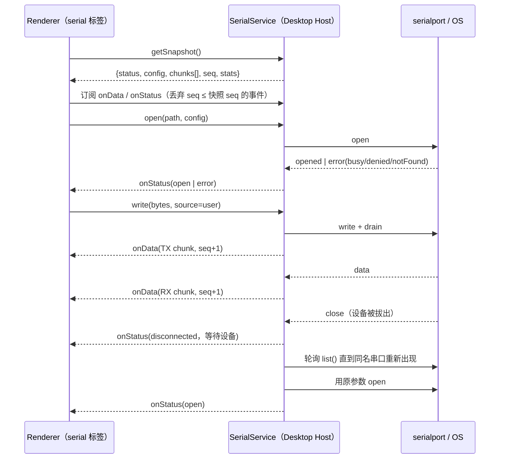

# 串口调试器（Serial Port Debugger）

2026-10-10。用户决定：在 Desktop 内置串口调试器，人与 Agent 最终共享同一串口会话。第一期只交付人用面板；
Agent 工具为第二期，但第一期接口按第二期需求设计，第二期不改协议。

## 范围

平台：仅 Desktop（Windows、macOS、Linux）。Web 客户端与手机远控不显示入口，`packages/server` 不注册串口服务。

第一期功能：

- 串口：枚举并热插拔刷新；打开与关闭。
- 参数：波特率（预设值加自定义）、数据位（5/6/7/8）、校验位（none/even/odd/mark/space）、停止位（1/1.5/2）、
  流控（none / RTS/CTS）。
- 接收：文本与 HEX 两种显示可切换；可选时间戳；编码可选 UTF-8 或 GBK；自动滚动、清屏、暂停显示；收发字节计数。
- 发送：文本与 HEX 两种模式；行尾可选（无/CR/LF/CRLF）；发送历史；发出的内容回显在接收区。
- 断开处理：设备断开后自动重连，默认开启，可手动关闭。
- 导出：把当前缓冲区内容导出为 `.log` 文件，格式跟随当前的显示模式（文本或 HEX）和编码。
- 参数记忆：全局按串口名记住上次使用的参数，打开面板时自动填好，但不自动连接。

第一期不做：定时循环发送、快捷指令、协议解析与校验和、波形绘图、同时打开多个串口、手动控制 DTR/RTS、
持续录制到文件。

## 所有者与生命周期

- 唯一所有者是窗口级 Desktop Host（utilityProcess）里的 `SerialService`。
  串口句柄、状态机、环形缓冲、热插拔轮询和自动重连都只在这里。
- 串口会话的生命周期跟随窗口：关闭标签、在窗口内切换视图或 workspace，都不会断开串口；
  窗口关闭、Host 退出时释放串口。
- 串口设备在本机，所以即使当前 workspace 是远程的，也始终使用本窗口的 Local Host 的 `SerialService`，
  不经过远程连接注册表。串口会话不与 `workspaceIdentity` 绑定。
- 每个窗口同一时刻最多打开一个串口，也最多一个 `serial` 标签。
- Main 只负责转发，不保存串口状态或占用表。跨窗口抢占同一串口时，由操作系统返回独占错误，
  Service 把它映射为 `busy`。
- Renderer 只保存未提交的发送草稿、显示偏好（文本/HEX、时间戳、编码、暂停）和渲染缓存，
  不把这些当作串口状态的来源。



快照与事件的衔接：Service 给每个 chunk 分配一个单调递增的 `seq`，快照里带上当前的最大 `seq`。
Renderer 先订阅、再取快照，把订阅期间先到的事件暂存起来；拿到快照后，丢弃 `seq` 不大于快照 `seq` 的事件，
其余事件按顺序追加，这样不会重复也不会遗漏。不允许用延时来规避这个时序问题。

## 状态机

`closed → opening → open → closing → closed`，另有两个状态：

- `disconnected`：串口处于 `open` 时设备消失，且自动重连开启。在这个状态下，同名串口重新出现时，
  先转到 `opening` 再到 `open`。用户点关闭时直接转到 `closed`，并停止等待。
- `error`：打开失败或重连失败。错误码为 `busy`、`denied`、`notFound`、`invalidConfig`、`nativeUnavailable`、
  `io`。从 `error` 状态可以再次 `open`。

如果自动重连关闭，设备消失时直接转到 `closed`。
同一时刻只有一个转换在进行；`open`/`close` 并发调用时按到达顺序串行处理。
在 `opening`/`closing` 期间收到的重复调用，返回同一个进行中的 Promise。
`write` 只在 `open` 状态下接受，其他状态下返回 `notOpen` 错误，不排队等待。

## 接口

放在 `packages/services/src/serial/`，channel 为 `ServiceChannels.Serial`（新增到 `packages/shared/src/channels.ts`），
并且只在 Desktop Host 的 `createLocalServices` 中注册。

```ts
type SerialSource = "user" | "agent";
type SerialDirection = "rx" | "tx";

interface SerialPortInfo {
  path: string; // Windows 上是 COM3，类 Unix 上是 /dev/tty.*
  manufacturer?: string;
  serialNumber?: string;
  vendorId?: string;
  productId?: string;
}

interface SerialConfig {
  baudRate: number;
  dataBits: 5 | 6 | 7 | 8;
  parity: "none" | "even" | "odd" | "mark" | "space";
  stopBits: 1 | 1.5 | 2;
  rtscts: boolean;
  autoReconnect: boolean;
}

interface SerialChunk {
  seq: number;
  at: number; // epoch ms：RX 为收到首字节的时间，TX 为提交写入的时间
  direction: SerialDirection;
  source: SerialSource; // rx 方向固定为 "user"，表示外部设备，不代表人操作
  bytes: Uint8Array;
}

interface ISerialService {
  list(): Promise<SerialPortInfo[]>;
  open(params: { path: string; config: SerialConfig }): Promise<void>;
  close(): Promise<void>;
  write(params: { bytes: Uint8Array; source: SerialSource }): Promise<void>;
  clear(): Promise<void>; // 清空环形缓冲，不影响串口状态
  getSnapshot(): Promise<SerialSnapshot>;
  setWatching(params: { watching: boolean }): Promise<void>; // 面板是否可见，用来控制热插拔轮询
  onData: Event<SerialChunk>;
  onStatus: Event<SerialStatus>;
  onPorts: Event<SerialPortInfo[]>;
}
```

- `bytes` 直接用 `Uint8Array` 传输。RPC 序列化对顶层和嵌套的 `Uint8Array` 都支持
  （`packages/rpc/src/serialization.ts`），不需要额外编码成 base64。
- rx 方向的 `source` 没有意义。实现时也可以改成可选字段，只在 tx 方向上必填，由实现阶段的类型设计决定，
  但不允许为它新增一个独立的协议版本。
- `write` 的单次上限为 64 KiB，超过时返回 `invalidInput`。
- 第二期的 Agent 访问会复用 `getSnapshot`、`onData` 和 `write(source="agent")`，第一期不提供 Agent 入口。

## 环形缓冲

- 按字节计上限 1 MiB，RX 和 TX 共用，存原始字节加上时间戳和元数据。超过上限时淘汰最旧的完整 chunk。
- Host 合并相邻的 RX 数据：同方向、间隔小于 10 ms 且合并后不超过 4 KiB 的数据合成一个 chunk，
  以控制事件频率。合并只影响 chunk 的切分边界，不改变字节内容和顺序。
- 文本/HEX 渲染、UTF-8/GBK 解码、时间戳格式化和行切分都在 Renderer 里做。
  GBK 解码使用浏览器内置的 `TextDecoder("gbk")`。多字节字符跨 chunk 时，使用 `stream: true` 模式解码。
- 渲染层最多显示最近 2000 行，超过时从头部截断显示，不影响 Service 里的缓冲和导出。
- TX 在提交写入时入缓冲，并先落下尚未合并完的 RX，保证回显排在设备对它的响应之前。
- 发送的文本统一按 UTF-8 编码；GBK 只用于接收显示。需要发送其他编码时使用 HEX 模式。

## 热插拔与轮询

`serialport` 没有设备变化事件，所以用 `list()` 轮询，间隔约 1.5 s。只在以下任一条件成立时轮询：

- 至少有一个面板通过 `setWatching(true)` 表示自己可见；
- 当前处于 `disconnected` 状态，正在等待重连。

两个条件都不成立时停止轮询。串口列表变化时发出 `onPorts`。

## 原生依赖

- 新增依赖 `serialport`（核心是 `@serialport/bindings-cpp`），照 node-pty 的方式处理：
  - prebuild 和 Electron ABI 对齐，并把串口加入 `scripts/node-pty-rebuild.mjs` 的同类处理流程；
  - `electron-builder.config.js` 的 `asarUnpack` 加入串口的 prebuild；
  - `scripts/desktop-native-package-policy.mjs` 按平台裁剪，并检查目标平台的二进制确实存在。
- 延迟加载：第一次调用 `list`/`open` 时才 `import`。加载失败时，`SerialService` 返回 `nativeUnavailable`
  和原因，面板显示"串口功能不可用"，不影响 Host 的其他服务。

## UI

- `packages/ui/src/lib/workspaceSidePane.ts` 新增标签类型 `serial` 和对应的 `openSerialSidePane`，
  在 `useAppPanels.ts` 里接线，由 `AnimatedSidePanePanel.tsx` 渲染。
- 入口放在侧边面板的"新建标签"菜单和命令面板，只在平台提供串口能力（Desktop）时显示，
  判定依据是 `IPlatformService.supportsSerialPort`（只有 Desktop 平台实现为 `true`）。
  Web 端和手机远控端都不显示入口。`IServiceAccessor.serialService` 为可选字段；
  远程 workspace 的服务组合沿用本地 base 服务，所以串口始终走本窗口的 Local Host。
- 组件通过 `packages/ui/src/hooks/` 里新增的 hook 访问 `ISerialService`，不直接调用 `window.escode`。
- 导出功能使用 `IPlatformService.saveFile`，导出内容在 Renderer 里由快照生成。
- 参数记忆：上次使用的串口和各串口的参数作为用户偏好，存进全局设置的 `serialPortPreferences` 字段（`lastPath` + `byPath`），按串口名作为 key，只在打开成功后写入。
  不存进 workspace，也不存进 Host 的状态。
- 布局、颜色、主题、国际化都遵守 `DESIGN.md`，优先复用已有组件。TX 回显使用区分色并加 `→` 前缀。
- 日志：UI 使用 `packages/ui/src/logger.ts`；Service 使用 `createServiceLogger("serial")`。
  打开、关闭、重连和错误记 `info`/`warn`，数据内容不写进日志。

## 错误映射

| OS 表现                                          | 错误码              | UI 提示                        |
| ------------------------------------------------ | ------------------- | ------------------------------ |
| Windows `Access denied`；类 Unix `EBUSY`、锁冲突 | `busy`              | 串口被其他程序或窗口占用       |
| 类 Unix `EACCES`（不在 dialout/uucp 组）         | `denied`            | 无权限访问串口，并说明如何授权 |
| `ENOENT`、设备不存在                             | `notFound`          | 串口不存在                     |
| 参数不被驱动接受                                 | `invalidConfig`     | 参数不受支持                   |
| 原生模块加载失败                                 | `nativeUnavailable` | 串口功能不可用（附原因）       |
| 其他读写错误                                     | `io`                | 读写错误（附原始消息）         |

## 第二期：Agent 访问（只定方向）

- 做一个内置插件，里面带一个 stdio MCP server。它不直接打开硬件，而是把请求转发给本窗口 Host 的
  `SerialService`，转发机制参照 browser-use 的 broker 模式。这样 TS 和 Rust 两套 runtime 都能用。
- 提供 `serial_list`、`serial_read`（按 `seq` 或时间读取缓冲区）、`serial_write`、
  `serial_wait_for`（等待匹配某个正则的输出，带超时）四个工具。
- `serial_write` 和打开、关闭串口都需要经过权限审批。Agent 收发的数据在面板里按 `source=agent` 标出。
- 到第二期再单独写 spec，补充 broker 鉴权、多会话并发写入的规则和审批粒度。

## 验收

单测（`packages/services`），使用 `@serialport/binding-mock` 注入虚拟串口：

- 打开、关闭，以及各种并发调用的串行化；`write` 在非 `open` 状态下被拒绝。
- RX/TX 都进入缓冲，`seq` 单调递增；超过 1 MiB 时淘汰最旧的 chunk；`clear` 只清缓冲，不改串口状态。
- 快照与事件的衔接：在订阅和取快照之间注入数据，最终结果无重复、无遗漏。
- 设备消失时：自动重连开启则转到 `disconnected`，同名串口重新出现后转到 `open`；
  自动重连关闭则转到 `closed`；在 `disconnected` 状态下调用 `close` 会停止轮询。
- 轮询只在有面板可见或等待重连时运行。
- 错误映射覆盖 `busy`、`notFound`、`invalidConfig`、`nativeUnavailable`。
- 原生模块缺失时，Host 其他服务仍能注册成功。

Renderer 单测：

- HEX 与文本的往返转换；HEX 输入的合法性校验（空格分隔、大小写、奇数位）；四种行尾。
- 多字节 UTF-8/GBK 字符跨 chunk 时能正确解码。

E2E（Desktop，使用同一个 mock binding）：场景见 `docs/test-cases/e2e/serial-port-debugger.feature`。
开发版以 `ESCODE_SERIAL_MOCK_PORTS=COM_MOCK1,COM_MOCK2` 启动时，`SerialService` 的默认 binding 改用
`@serialport/binding-mock` 的回环虚拟串口。binding-mock 只是开发依赖，在打包配置中外置，安装包里不存在。

- 从新建标签菜单打开面板，选择虚拟串口并连接，发送文本和 HEX，确认回显和接收显示正确，
  切换文本/HEX 显示，清屏，导出。
- 关闭标签后串口保持打开，重新打开标签后能看到之前的数据。
- Web 端不显示入口。

手动验收：在 Windows、macOS、Linux 上各用一个真实 USB 串口设备（CH340 或 CP210x 之类）完成收发、
拔出与自动重连、跨窗口占用提示，并检查各平台打包产物里有串口原生二进制。
